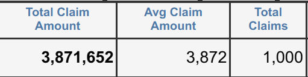
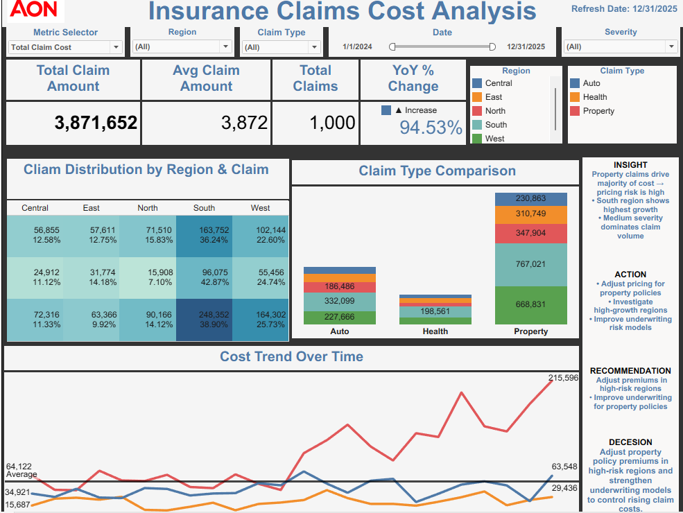
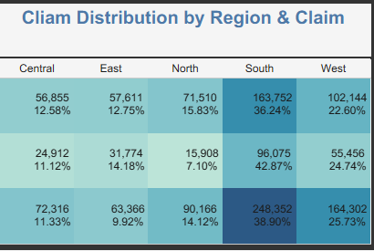
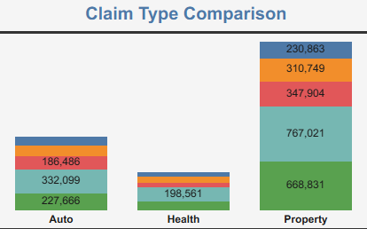
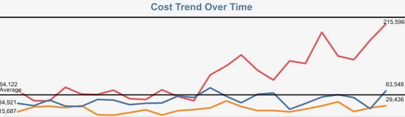

# Insurance Claims Cost Analysis

## Executive Summary

This project analyzes insurance claim costs across regions, claim types, severity levels, and time periods to help insurance leadership identify high-cost drivers, improve underwriting decisions, and prioritize pricing actions.

The dashboard provides a centralized view of:

* **Total Claim Cost:** **$3,871,652**
* **Average Claim Amount:** **$3,872**
* **Total Claims:** **1,000**
* **YoY Cost Change:** **94.53% Increase**

The analysis highlights how **property claims**, **regional concentration**, and **severity patterns** influence insurance claim exposure and business risk.

---

# Business Problem

Insurance organizations face increasing claim costs driven by claim severity, regional concentration, and high-risk claim categories. Without centralized reporting, leadership may struggle to quickly identify:

* Which claim types create the largest financial exposure
* Which regions drive claim growth
* How severity impacts overall claim costs
* Where underwriting and pricing decisions should be adjusted

This project was designed to provide an **executive decision-support dashboard** that transforms raw claims data into actionable business insights for pricing, underwriting, and operational reporting.

---
# Decision Support Use Case

This dashboard helps insurance leadership monitor claim cost trends, identify high-risk claim categories, evaluate severity patterns, and support data-driven decisions related to risk management, pricing strategy, claims operations, and financial performance.
---

# Business Questions

This dashboard answers key insurance business questions:

1. Which claim types generate the highest total cost?
2. Which regions contribute most to insurance losses?
3. How are claim costs changing over time?
4. Which severity levels dominate claim volume?
5. Where should pricing and underwriting interventions be prioritized?

---

# KPI Goals

The dashboard tracks:

* Total Claim Cost
* Average Claim Amount
* Total Claims
* Year-over-Year (YoY) Cost Change
* Claim Cost by Region
* Claim Cost by Claim Type
* Severity Distribution
* Monthly Cost Trend
* High-Cost Claim Exposure

---

# Dataset Overview

| Metric | Details |
|--------|---------|
| Dataset Size | 1,000 Rows |
| Columns | 16 |
| Date Range | 2024-01-01 → 2025-12-31 |
| Industry | Insurance |
| Dataset Type | Synthetic Insurance Claims Dataset |
| Use Case | Cost Monitoring, Risk Segmentation, Executive Reporting |

### Key Fields

* Claim ID
* Claim Date
* Region
* Claim Type
* Severity
* Claim Amount
* Policy ID
* Customer ID
* Broker ID
* Claim Status

---

# Project Folder Structure

```text
Claims-Cost-Risk-Analytics/
│── README.md
│── requirements.txt
│── streamlit_app.py
│
│── data/
│   ├── raw/
│   └── cleaned/
│
│── notebooks/
│   └── insurance_claims_eda.ipynb
│
│── screenshots/
│   ├── kpi_summary.png
│   ├── dashboard_overview.png
│   ├── claim_distribution.png
│   ├── claim_type_comparison.png
│   └── cost_trend.png
│
│── sql/
│   └── insurance_claim_queries.sql
```

---

# EDA & Data Cleaning

The exploratory data analysis (EDA) and cleaning process is documented in:

```text
notebooks/insurance_claims_eda.ipynb
```

### Data Cleaning Workflow

#### Data Validation

* Checked dataset structure and column consistency
* Reviewed data types for numeric and categorical fields
* Converted claim dates into datetime format

#### Data Quality Checks

* Checked missing values
* Removed duplicate records
* Validated claim amount ranges
* Standardized categorical values

#### Feature Engineering

Created additional analytical fields:

* Month
* Quarter
* Year
* High-Cost Claim Flag
* Cost Band Categories
* Claim Severity Segments

#### EDA Analysis

* Claim distribution by region
* Claim cost by claim type
* Severity analysis
* Monthly cost trends
* Outlier detection
* Cost concentration analysis

---

# Executive KPI Summary



---

# Dashboard Overview



---

# Key Dashboard Visuals

## Claim Distribution by Region & Claim Type



## Claim Type Comparison



## Cost Trend Over Time



---

# Business Impact

This project demonstrates how insurance organizations can use analytics to improve pricing decisions, strengthen underwriting strategies, monitor claim cost growth, reduce loss exposure, and support data-driven insurance operations.

---

### Tools Used

**SQL • Tableau • Python • Pandas • Streamlit • Excel • Power Query**
