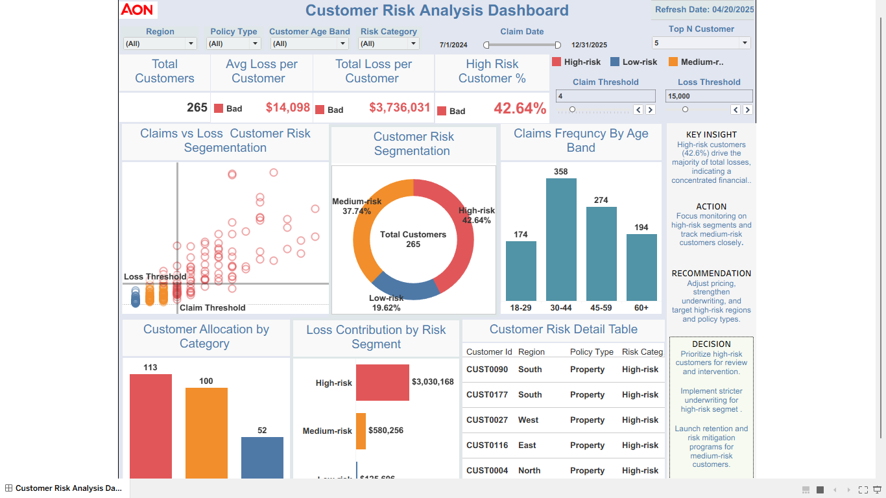

# Customer Risk Analysis Dashboard



## Executive Summary
This repository converts the Tableau-style **Customer Risk Analysis Dashboard** into a complete analytics portfolio project with a Streamlit app, SQL logic, EDA notebook, data cleaning documentation, KPI definitions, and dashboard-ready risk segmentation.

The Streamlit app includes every major dashboard component shown in the screenshot: KPI cards, filters, threshold controls, top-N selector, segmentation scatter plot, risk donut chart, claims by age band, allocation chart, loss contribution chart, customer detail table, and an Insight → Action → Recommendation → Decision panel.

## Business Problem
Insurance teams need a clear way to identify customers with high claim frequency and high financial loss exposure so they can prioritize review, underwriting action, pricing changes, retention programs, and risk mitigation.

## KPI Goals
| KPI | Purpose |
|---|---|
| Total Customers | Measures the selected customer population |
| Avg Loss per Customer | Tracks average financial exposure per customer |
| Total Loss | Measures total claim loss exposure |
| High Risk Customer % | Identifies the share of customers requiring immediate review |
| Risk Segment Loss Contribution | Shows which risk category drives the most loss |

## Dataset
- Rows: **1,000 cleaned claim records**
- Unique customers: **265**
- Claim date range: **2024-07-01 to 2025-12-31**
- Core fields: claim ID, claim date, customer ID, region, policy type, age band, tenure, annual premium, claim status, and claim amount

## Data Cleaning & EDA Enhancements
The EDA work was expanded beyond basic charts to include:

- Column name standardization
- Duplicate claim ID checks
- Missing-value checks
- Date parsing validation
- Numeric conversion for premium, tenure, and claim amount
- Negative-value validation
- Category normalization for region, policy type, and claim status
- Loss ratio feature engineering
- Claim month feature engineering
- Customer-level aggregation
- Risk category derivation
- Monthly loss trend analysis
- Claim distribution analysis by policy type
- Regional loss analysis
- Correlation heatmap for numeric variables

## SQL / Data Preparation
SQL scripts are included in `/sql`:

```text
sql/
├── customer_risk_cleaning.sql
├── dashboard_kpis.sql
└── risk_segmentation.sql
```

## Dashboard Preview
The Streamlit app recreates the Tableau dashboard and adds a cleaning-focused EDA tab.

Run locally:

```bash
pip install -r requirements.txt
streamlit run app/streamlit_app.py
```

## Key Insights
- High-risk customers represent a material share of total customer exposure.
- Loss is concentrated among customers with higher claim frequency and higher total loss.
- Age band, region, and policy type filters help isolate the segments driving risk.
- Medium-risk customers should be monitored because they can migrate into high-risk status.

## Recommendations
- Prioritize high-risk customers for underwriting review.
- Monitor medium-risk customers with early-warning thresholds.
- Use claim and loss thresholds to support pricing and risk-mitigation decisions.
- Target high-loss regions and policy types for deeper investigation.

## Decision
Prioritize high-risk customers for review and intervention. Launch retention and risk-mitigation programs for medium-risk customers.

## Business Impact
This project helps demonstrate how analytics can convert claim-level data into customer-level decisions by supporting risk prioritization, executive reporting, and operational monitoring.

## Repo Architecture
```text
customer-risk-analysis-repo/
├── app/
│   ├── components.py
│   ├── streamlit_app.py
│   └── utils.py
├── data/
│   └── customer_risk.csv
├── dashboard/
│   └── tableau_dashboard_placeholder.md
├── docs/
│   ├── business_case.md
│   ├── dashboard_guide.md
│   ├── kpi_definitions.md
│   └── modern_repo_formula.txt
├── notebooks/
│   └── eda_cleaning_customer_risk.ipynb
├── screenshots/
│   └── customer_risk_dashboard.png
├── sql/
│   ├── customer_risk_cleaning.sql
│   ├── dashboard_kpis.sql
│   └── risk_segmentation.sql
├── .gitignore
├── README.md
└── requirements.txt
```

## Tech Stack
- Python
- Pandas
- NumPy
- Plotly
- Streamlit
- SQL
- Tableau dashboard screenshot

## Portfolio Positioning
This project is aligned with a **Data Analyst (Healthcare & Tech) with Product Analytics Skills** profile by showing KPI thinking, customer segmentation, risk analytics, EDA, dashboarding, and decision-support storytelling.
