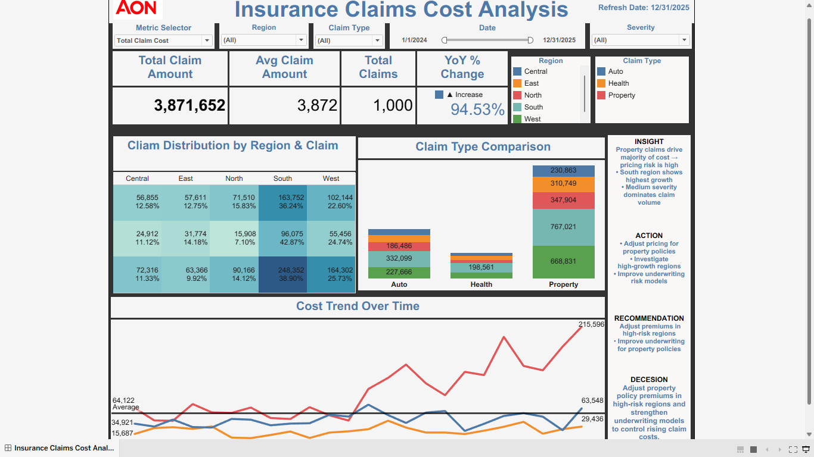

# Insurance Claims Cost Analysis

## Executive Summary
This project analyzes insurance claim costs across regions, claim types, severity levels, and time periods to help leadership identify high-cost drivers, improve underwriting decisions, and prioritize pricing actions.

The Tableau dashboard shows a total claim cost of **$3,871,652**, **1,000 claims**, and an average claim amount of **$3,872** across the claim portfolio.

## Business Problem
Insurance claims costs can rise quickly when high-severity claims, regional concentration, and claim-type risk are not monitored together. The business needs a decision dashboard that shows where cost is increasing, which claim categories drive the largest loss exposure, and what actions should be taken to improve pricing and underwriting performance.

## KPI Goals
- Total Claim Cost
- Average Claim Amount
- Total Claims
- Year-over-Year Cost Change
- Claim Cost by Region
- Claim Cost by Claim Type
- Claim Cost by Severity
- Monthly Cost Trend
- High-Cost Claim Share

## Dataset Overview
- Rows: **1,000**
- Columns: **16**
- Date range: **2024-01-01 to 2025-12-31**
- Key fields: claim date, region, claim type, severity, status, policy ID, customer ID, broker ID, claim amount
- Source type: synthetic insurance claims dataset for portfolio analytics practice

## Data Cleaning & EDA
The EDA workflow includes:
- Standardized column names
- Converted claim dates into datetime format
- Validated numeric claim amount fields
- Checked missing values and duplicate records
- Reviewed categorical columns such as region, claim type, severity, and claim status
- Created month, quarter, cost band, and high-cost flag features
- Validated KPI totals against dashboard-level metrics
- Exported a cleaned dataset for SQL, Tableau, and Streamlit use

## SQL Transformations
SQL scripts include:
- KPI summary query
- Monthly trend query
- Region and claim type segmentation
- Severity analysis
- High-cost claim analysis
- Broker and customer claim exposure
- Executive decision tables

## Metrics Engineering
```text
Total Claim Cost = SUM(claim_amount)
Average Claim Amount = AVG(claim_amount)
Total Claims = COUNT(DISTINCT claim_id)
High-Cost Claim Flag = claim_amount >= 75th percentile
YoY % Change = (Current Year Cost - Prior Year Cost) / Prior Year Cost
```

## Tableau Dashboard Preview


The dashboard presents claim cost distribution by region and claim type, claim type comparison, monthly cost trend, and executive decision notes.

## Streamlit Dashboard Recreation
The Streamlit app recreates the Tableau dashboard using Python and Plotly. It includes filters, KPI cards, regional distribution, claim type comparison, monthly cost trend, severity analysis, high-cost claim detection, and an executive decision section.

Run locally:
```bash
pip install -r requirements.txt
streamlit run app/streamlit_app.py
```

## Product Insights
Property claims represent the largest cost driver and should receive deeper pricing and underwriting review. Regional concentration also matters because high-cost regions create portfolio-level loss exposure. Medium-to-high severity claims dominate claim volume and require stronger monitoring.

## Insight, Action, Recommendation, Decision
### Insight
Property claims and high-growth regions drive the majority of claim cost exposure, increasing pricing and underwriting risk.

### Action
Monitor property claims, high-severity claims, and regional cost trends monthly to detect early cost escalation.

### Recommendation
Adjust premiums in high-risk regions, improve underwriting rules for property policies, and investigate brokers or customer groups with repeated high-cost claims.

### Decision
Prioritize pricing review and underwriting model strengthening for property policies and high-cost regions to reduce rising claim costs.

## Business Impact
This project helps insurance leaders reduce loss exposure, identify cost concentration, improve pricing decisions, and create a repeatable analytics workflow across Tableau, SQL, Python, and Streamlit.

## Future Improvements
- Add predictive claim severity modeling
- Add automated refresh pipeline with scheduled SQL or Python
- Add fraud-risk scoring
- Add policy-level profitability analysis
- Deploy Streamlit app publicly
